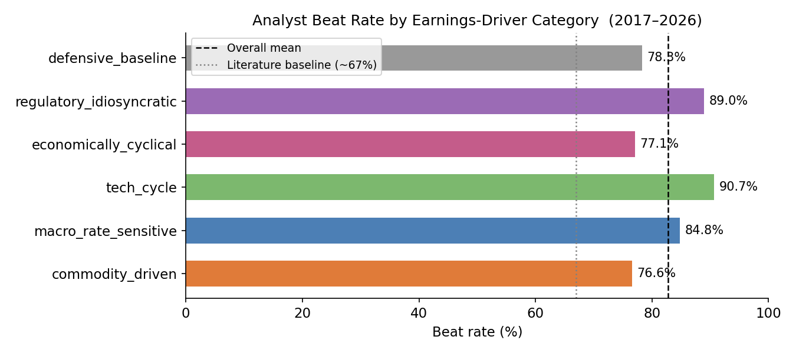
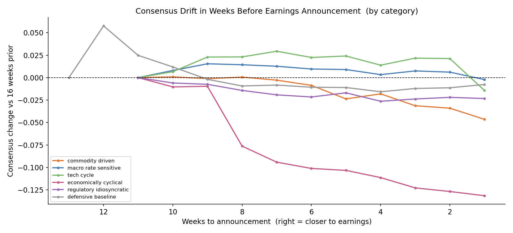
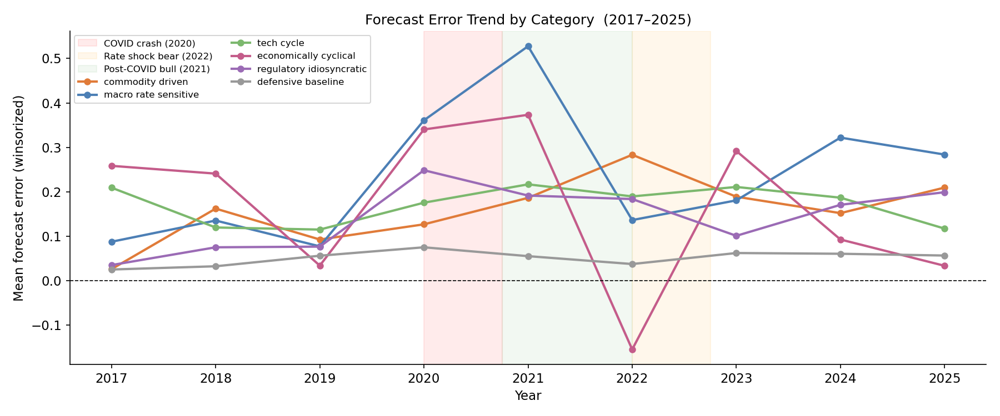
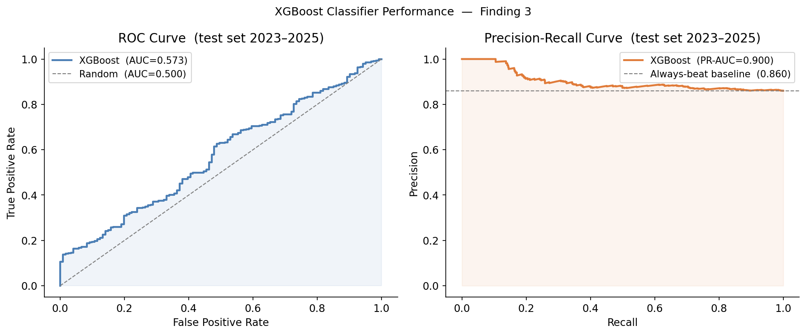

<div align="center">

# Analyst Forecast Bias

**Structure, Regime Sensitivity, and Predictive Signals**

*Souradeep Roy*


</div>

---

Every quarter, Wall Street analysts publish their earnings estimates for publicly traded companies. These estimates get aggregated into a consensus figure that the market prices in ahead of the actual announcement. When a company reports, the difference between what it actually earned and what analysts expected is the forecast error - and the direction of that error is whether the company "beat" or "missed."

The well-documented pattern is that companies beat more often than they miss. Across this dataset of 72 large-cap US companies over nine years, the overall beat rate is around 82%. That alone is not surprising - it is a known feature of how the analyst ecosystem works, driven partly by management guidance, partly by how estimates get revised as the quarter progresses, and partly by the structural incentives analysts face. What is less well understood is how that bias is distributed: which types of companies carry most of it, whether market conditions change how large it is, and whether the footprint left by the revision process itself contains any signal about what is coming.

Those three questions are what this project is built around.

<p align="center">
  
</p>

The 72 companies are split into six earnings-driver categories - not by sector, but by the primary mechanism that drives their earnings. Tech cycle companies (NVDA, ASML, AMD) are driven by product and semiconductor cycles. Macro rate sensitive (JPM, GS, BAC) move with the rate environment. Commodity driven (XOM, CVX, COP) follow oil and metals prices. Economically cyclical (CAT, AMZN, HD) track the broader economic cycle. Regulatory idiosyncratic (LLY, PFE, UNH) turn on FDA approvals and policy decisions. Defensive baseline (PG, KO, WMT) is the control group - stable, predictable businesses with deep analyst coverage, chosen specifically because they should show the least distortion if the patterns found elsewhere are real.

---

## What This Project Studies

**Does the bias vary by what type of company it is?**

This is the structural question. If all categories showed identical bias, the phenomenon would be uniform and category membership would tell you nothing. The data shows they are not identical, and the differences are interpretable - financials carry the most bias because their earnings are driven by the rate spread, which is itself uncertain. Tech companies are consistently underestimated. Defensive companies are underestimated the least. A hierarchical Bayesian model (PyMC) is used to estimate these category effects with proper uncertainty quantification, and to separate them from macro effects that happen to coincide.

**Does the macro environment change how large the error is?**

This is the regime question. The intuition is that uncertain markets should make forecasting harder. But there are two competing hypotheses: maybe what matters is market direction (bull vs bear), or maybe what matters is the level of uncertainty (VIX). A three-state Hidden Markov Model is fitted to nine years of S&P 500 returns to label market regimes, and the Bayesian model tests both the direction and the uncertainty channel.

**Can you predict a beat or miss before it happens?**

Analysts revise their estimates continuously in the weeks before an announcement. The direction and shape of those revisions - whether consensus is drifting up or down, whether it is accelerating, whether analysts are disagreeing more or less - might contain information about whether the company will beat. Seven features are engineered from 63,744 weekly consensus snapshots and fed into an XGBoost classifier to test whether that signal is real and, if so, for which types of companies it holds up.

<p align="center">
  
</p>

The chart above shows how consensus estimates move in the 16 weeks before each announcement, by category. Tech cycle companies (green) drift upward as the quarter closes. Economically cyclical (pink) drift downward. The shape of this drift is the raw input to the revision path features - and the fact that different categories show systematically different drift patterns is part of why category membership ends up being the strongest single predictor in the classifier.

---

## What We Found

**The macro environment matters, but through uncertainty rather than direction.** In the Bayesian model, quarterly VIX has a credible positive effect on forecast error - analysts miss more when uncertainty is high. The S&P 500 return for the same quarter has no credible effect. That is a sharper claim than the usual observation that bear markets cause more misses: the data says it is volatility that disrupts forecasting, not the direction the market went.

**Bias is structural and category-dependent, and the control group validates the design.** Bootstrap confidence intervals across 10,000 resamples exclude zero for all six categories, with means ranging from 0.054 EPS (defensive baseline) to 0.249 EPS (macro rate sensitive). In the Bayesian model, defensive baseline is the only category whose posterior credible interval excludes zero on the negative side - in other words, it is the only group the model is confident is less biased than average. That is what you want a control group to do. The notable outlier is economically cyclical in 2022, the only year in the entire dataset where a category showed negative mean forecast error, meaning analysts overestimated. It happened in the one year a rate shock hit consumer and industrial spending hard enough to outpace how quickly estimates moved.

<p align="center">
  
</p>

**The revision path contains real signal, but only for certain categories.** The XGBoost classifier trained on pre-announcement revision path features achieves AUC-ROC of 0.573 on the held-out 2023-2025 test set against a random baseline of 0.500. Tech cycle companies reach 0.673 - their revision pattern is consistent enough that the model learns it. Commodity driven companies reach 0.440 and regulatory idiosyncratic 0.453, both below random. For those categories, watching consensus revisions actively misleads you: the outcome is determined by events (price moves, approval decisions) that have not happened yet when the estimates are filed.

<p align="center">
  
</p>

The ROC curve (left) shows the classifier consistently above the random diagonal across all thresholds. The precision-recall curve (right) starts near 1.0 precision at low recall - meaning the highest-confidence beat predictions are very clean - before declining as recall increases. The overall PR-AUC of 0.900 compares to an always-beat baseline of 0.860. The lift is modest, as expected on a hard problem, but it is consistent and the calibration holds.

---

## Read the Full Report

The six-page PDF covers the full methodology, model specification, convergence diagnostics, prior choices, and limitations. It includes four embedded figures directly tied to the findings.

<div align="center">

**[Analyst Forecast Bias - Full Report (PDF)](reports/analyst_forecast_bias_report.pdf)**

</div>

---

## How It's Built

The pipeline runs in seven steps, each a standalone Python module:

| Module | What it does |
|---|---|
| [`ingest.py`](src/ingest.py) | Filters raw Dolt table exports to 72 tickers and the study date range |
| [`clean.py`](src/clean.py) | Computes forecast error, winsorizes by category, builds the main panel |
| [`macro.py`](src/macro.py) | Downloads quarterly S&P 500 return and VIX via yfinance, z-scores both, merges onto panel |
| [`regime.py`](src/regime.py) | Fits a 3-state Gaussian HMM to monthly S&P 500 returns to label market regimes |
| [`features.py`](src/features.py) | Builds 7 revision path features per ticker-quarter from weekly consensus snapshots |
| [`models.py`](src/models.py) | Fits the hierarchical Bayesian Student-t model in PyMC (NUTS, 4 chains x 2,000 draws) |
| [`signals.py`](src/signals.py) | Trains the XGBoost beat/miss classifier with a strict temporal train/test split |

Raw data comes from the [DoltHub open earnings database](https://www.dolthub.com/repositories/dolthub/earnings), a versioned SQL database of EPS actuals and consensus estimates across all US equities. The 72 tickers and all model parameters are configured in [`configs/model_params.yml`](configs/model_params.yml).

---

## Setup

```bash
git clone https://github.com/souro26/analyst-forecast-bias.git
cd analyst-forecast-bias

conda env create -f environment.yml
conda activate forecast-bias

# Pull data from DoltHub
cd data/external/earnings
dolt clone dolthub/earnings .
dolt table export eps_history   ../../../data/raw/eps_history_full.csv
dolt table export eps_estimate  ../../../data/raw/eps_estimate_full.csv
cd ../../..

# Optional - only needed if HMM fails to converge
echo "FRED_API_KEY=your_key" > .env

# Run in order
python src/ingest.py
python src/clean.py
python src/macro.py
python src/regime.py
python src/features.py
python src/models.py      # ~20 min on 4 cores
python src/signals.py
```

Logs for each step are written to `logs/`. All model outputs go to `models/`, all figures to `reports/figures/`.

---

## License

MIT
