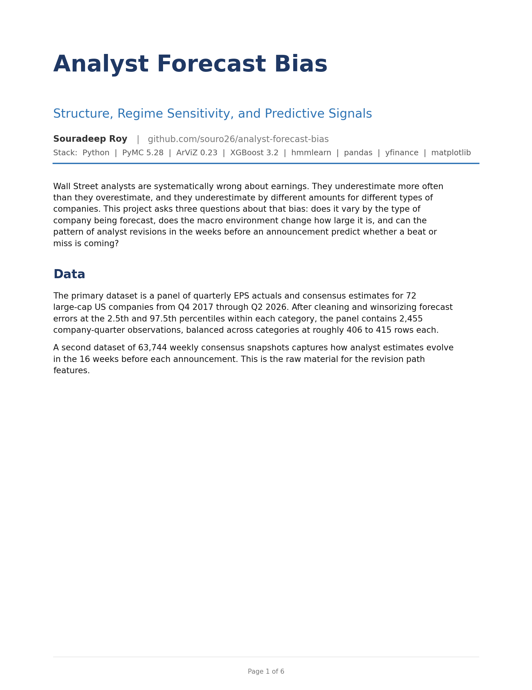
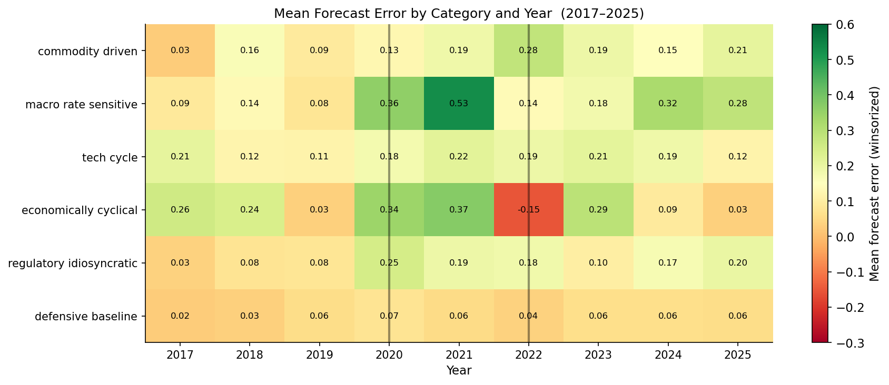
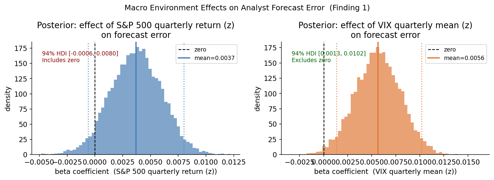
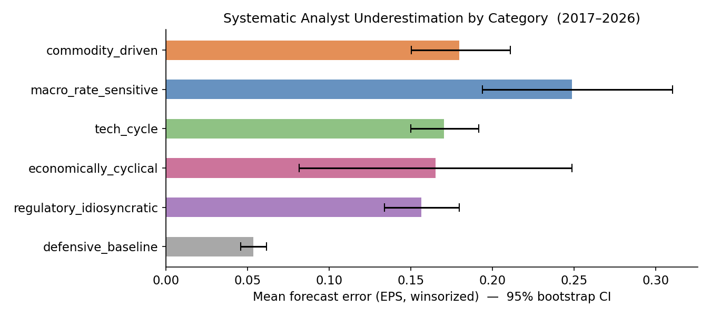
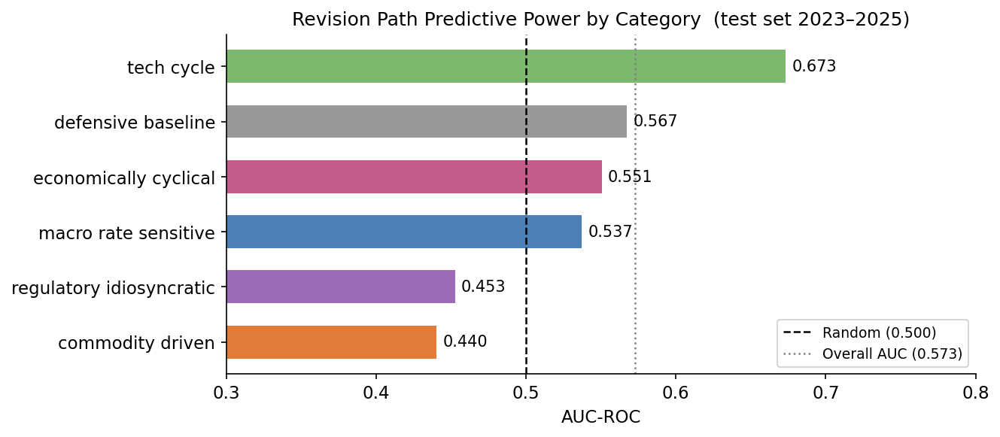
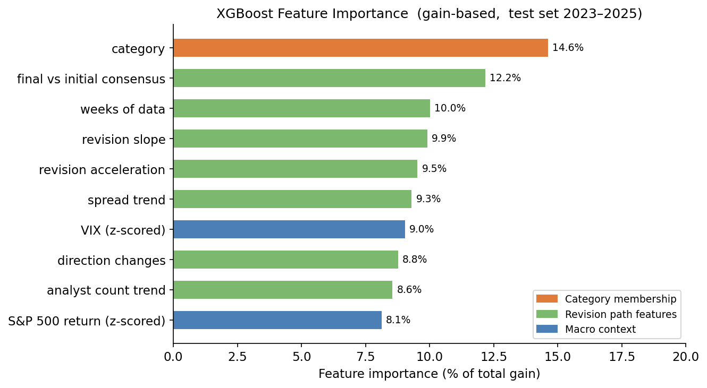
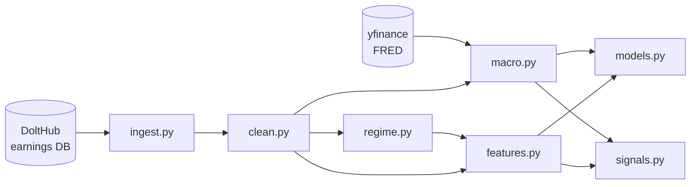

<div align="center">

# Analyst Forecast Bias

**Structure, Regime Sensitivity, and Predictive Signals**

*Souradeep Roy*


</div>

---

Wall Street analysts systematically underestimate earnings — but not uniformly. The magnitude of the bias varies by what drives a company's earnings, shifts with market uncertainty rather than market direction, and leaves a learnable signature in the pattern of analyst revisions before an announcement. This project quantifies all three phenomena on a panel of **72 large-cap US companies across nine fiscal years (Q4 2017 – Q2 2026)**.

**Dataset:**  2,455 company-quarter observations  ·  63,744 weekly consensus snapshots  ·  6 earnings-driver categories  ·  Data sourced from the [DoltHub open earnings database](https://www.dolthub.com/), not a pre-packaged CSV

---

## Three Findings

**1 - Market uncertainty amplifies analyst error; market direction does not**

The hierarchical Bayesian model (PyMC, NUTS) puts **β_VIX = 0.006 EPS** with a 94% credible interval of **[0.001, 0.010]**, which excludes zero. The S&P 500 return coefficient is **β_S&P = 0.004** with HDI **[-0.001, 0.008]**, which includes zero. Analysts miss more in high-uncertainty quarters, not just in down markets. A volatile but flat quarter does more damage to forecast accuracy than a steadily declining one. The grand mean underestimation across the full panel is **μ_global = 0.072 EPS** - roughly seven cents a share.

**2 - Bias is structural and varies by earnings driver; the control group holds**

Bootstrap confidence intervals (10,000 resamples) exclude zero for all six categories. Mean underestimation runs from **0.054 EPS** (defensive baseline) up to **0.249 EPS** (macro rate sensitive). In the Bayesian model, **defensive baseline is the only category whose posterior credible interval excludes zero** (α = -0.034, HDI [-0.061, -0.010]). That is the control group - 12 companies with stable, predictable earnings and deep analyst coverage. It produces the smallest and most credible bias in the dataset, which is what you would expect if the patterns in the other categories are real. The one exception in the data is 2022 economically cyclical (**-0.15 EPS**), the only negative cell in nine years. Bias flipped sign in the one year a rate shock hit consumer and industrial spending faster than estimates could track it.

**3 - Revision paths contain signal, but it depends on the category**

An XGBoost classifier on 7 pre-announcement revision path features reaches **AUC-ROC = 0.573** on the held-out 2023-2025 test set (random baseline = 0.500). Per category: **tech cycle = 0.673**; defensive baseline 0.567; economically cyclical 0.551; macro rate sensitive 0.537; **commodity driven = 0.440 and regulatory idiosyncratic = 0.453, both below random**. For commodity and regulatory companies, the revision path actively misleads - their outcomes turn on price moves and FDA decisions that happen after analysts have already filed their numbers. Category membership is the single strongest feature at **14.6% of gain**. Revision path features collectively contribute 56%, VIX and S&P 500 return add 17%.

---

## Report

<div align="center">

[](reports/analyst_forecast_bias_report.pdf)

**[Read the full 6-page report →](reports/analyst_forecast_bias_report.pdf)**

</div>

---

## Key Figures

### Category x Year Heatmap - the 2022 anomaly

Every cell in this panel is positive except one: economically cyclical in 2022. That is the only year analysts overestimated for that group, and it happened to be the year a rapid rate hike hit consumer and industrial spending before estimates had a chance to adjust.

<p align="center">
  
</p>

---

### Finding 1 - VIX credibly amplifies error; S&P 500 does not

Posterior distributions for both macro coefficients. The VIX posterior (orange) sits fully to the right of zero. The S&P 500 return posterior (blue) straddles it. That asymmetry is the main result of Finding 1.

<p align="center">
  
</p>

---

### Finding 2 - Systematic underestimation across all categories

Bootstrap 95% CIs on mean forecast error. Every bar excludes zero. Defensive baseline, the control group, is the smallest. Macro rate sensitive is the largest - financials' earnings move with the rate environment, which is itself hard to predict.

<p align="center">
  
</p>

---

### Finding 3 - Revision path predictive power by category

Tech cycle companies reach AUC = 0.673. Their revision pattern is biased in a consistent direction and the model picks that up. Commodity and regulatory companies fall below random because their outcomes depend on events - price moves, approval decisions - that happen after the estimates are already in.

<p align="center">
  
</p>

---

### Feature importance - all three layers show up

Category membership ranks first at 14.6%, but the 7 revision path features fill the next 8 slots and collectively account for 56%. VIX and S&P 500 return add another 17%. All three parts of the project - category effects, revision dynamics, and macro context - show up in the ranking independently.

<p align="center">
  
</p>

---

## Methodology

Three models in sequence, each answering a different question:

**Hidden Markov Model (regime detection):** A three-state Gaussian HMM fitted to monthly S&P 500 returns from 2016 to 2026 (`hmmlearn`) labels each month as bull, sideways, or bear. The bear state is characterized by high volatility (σ = 0.075/month), not negative returns - March 2020, June 2022, and Q4 2018 all label correctly. These regime labels informed the EDA but were replaced by continuous VIX in the Bayesian model. With only nine years of data there are three to four years per regime at most, which is not enough to estimate separate effects credibly.

**Hierarchical Bayesian model (bias structure):** Three levels - grand mean, category offsets, continuous macro predictors - fitted in PyMC with NUTS sampling (4 chains x 2,000 draws, R-hat = 1.000 everywhere, min ESS = 1,396, zero divergences). The likelihood is Student-t rather than Normal. QQ plots showed heavy tails across all six categories, and the posterior for the degrees-of-freedom parameter sits tightly at ν ≈ 1.15, well below the threshold of 30 where Student-t approximates Normal.

**XGBoost classifier (predictive signal):** Binary classifier (beat/miss) from 7 pre-announcement revision path features plus category and macro context. The train/test split is strictly temporal: 2017-2022 for training, 2023-2025 for testing. No random split was used because it would let future quarters leak into training. The 82% beat rate is handled with `scale_pos_weight`. Evaluation uses AUC-ROC and PR-AUC, not accuracy.

*Full methodology, convergence diagnostics, and limitations are in the [6-page PDF report](reports/analyst_forecast_bias_report.pdf).*

---

## Pipeline



| Module | Input | Output | What it does |
|---|---|---|---|
| [`ingest.py`](src/ingest.py) | Raw Dolt CSV dumps | `data/raw/eps_*.csv` | Filters full table exports to 72 tickers and date range; validates ticker coverage |
| [`clean.py`](src/clean.py) | `data/raw/eps_*.csv` | `data/processed/panel.parquet`<br>`data/processed/estimate_panel.parquet` | Computes forecast error, winsorizes by category (1st/99th pct), adds fiscal quarter labels |
| [`macro.py`](src/macro.py) | `panel.parquet` + yfinance | `panel.parquet` (updated) | Downloads quarterly S&P 500 return and mean VIX; z-scores both; merges onto panel |
| [`regime.py`](src/regime.py) | yfinance / FRED | `data/processed/regimes.parquet` | Fits 3-state Gaussian HMM to monthly S&P 500 returns; validates against known periods; FRED fallback if HMM diverges |
| [`features.py`](src/features.py) | `estimate_panel.parquet` | `data/processed/features.parquet` | Builds 7 revision path features per ticker-quarter from weekly consensus snapshots |
| [`models.py`](src/models.py) | `panel.parquet` + `features.parquet` | `models/trace.nc`<br>`models/summary.csv` | Fits hierarchical Bayesian Student-t model in PyMC; checks R-hat and ESS; extracts posterior summary |
| [`signals.py`](src/signals.py) | `panel.parquet` + `features.parquet` | `models/xgb_model.json`<br>`models/xgb_results.csv`<br>`models/xgb_feature_importance.csv` | Trains XGBoost beat/miss classifier with temporal split; evaluates AUC-ROC and PR-AUC per category |

---

## Data

| Source | What | How |
|---|---|---|
| [DoltHub - `dolthub/earnings`](https://www.dolthub.com/repositories/dolthub/earnings) | Quarterly EPS actuals + weekly consensus estimates for all US equities | `dolt table export`, then filtered to 72 tickers by `ingest.py` |
| [yfinance](https://github.com/ranaroussi/yfinance) | S&P 500 monthly prices (for HMM) and quarterly returns + VIX | Downloaded at runtime by `macro.py` and `regime.py` |
| [FRED API](https://fred.stlouisfed.org/) | USREC recession indicator (fallback if HMM diverges) | Via `fredapi` in `regime.py` if needed |

**72 tickers across 6 earnings-driver categories** (12 tickers each): commodity driven · macro rate sensitive · tech cycle · economically cyclical · regulatory idiosyncratic · defensive baseline. Full ticker list in [`configs/model_params.yml`](configs/model_params.yml).

---

## Setup & Reproduction

```bash
git clone https://github.com/souro26/analyst-forecast-bias.git
cd analyst-forecast-bias

# Create environment
conda env create -f environment.yml
conda activate forecast-bias   # or your env name

# Pull raw data from DoltHub
cd data/external/earnings
dolt clone dolthub/earnings .
dolt table export eps_history   ../../../data/raw/eps_history_full.csv
dolt table export eps_estimate  ../../../data/raw/eps_estimate_full.csv
cd ../../..

# Copy FRED API key (only needed if HMM fails to converge)
echo "FRED_API_KEY=your_key_here" > .env

# Run pipeline in order
python src/ingest.py      # filter + validate ticker coverage
python src/clean.py       # clean, compute forecast_error, winsorize
python src/macro.py       # download VIX + S&P 500, z-score, merge
python src/regime.py      # fit 3-state HMM, label market regimes
python src/features.py    # engineer 7 revision path features
python src/models.py      # hierarchical Bayesian model - NUTS, ~20 min on 4 cores
python src/signals.py     # XGBoost classifier + evaluation
```

**Runtime:** `models.py` takes around 20 minutes with 4 chains x 2,000 draws. Everything else runs in under 2 minutes. Logs for each step are written to `logs/`.

---

## Repository Structure

```
analyst-forecast-bias/
│
├── configs/
│   └── model_params.yml          # ticker universe, MCMC settings, winsorize bounds, date range
│
├── data/
│   ├── external/earnings/        # Dolt database checkout (gitignored)
│   ├── raw/                      # filtered CSVs from ingest.py (gitignored)
│   └── processed/                # panel.parquet, features.parquet, regimes.parquet
│
├── models/
│   ├── trace.nc                  # PyMC posterior trace (ArViZ NetCDF format)
│   ├── summary.csv               # posterior means, SDs, 94% HDIs, R-hat for all params
│   ├── xgb_model.json            # fitted XGBoost classifier
│   ├── xgb_results.csv           # per-observation predictions and actuals (test set)
│   └── xgb_feature_importance.csv
│
├── notebooks/
│   ├── 01_raw_exploration.ipynb  # Dolt data structure and initial profiling
│   ├── 02_eda.ipynb              # distribution analysis, QQ plots, heatmaps, revision paths
│   └── 03_model_results.ipynb   # posterior inspection, trace plots, classifier evaluation
│
├── reports/
│   ├── analyst_forecast_bias_report.pdf   # 6-page research report (with embedded figures)
│   ├── cover_thumbnail.png
│   └── figures/                           # 21 output figures (PNG)
│
├── src/
│   ├── ingest.py                 # data ingestion and ticker filtering
│   ├── clean.py                  # cleaning, winsorization, panel construction
│   ├── macro.py                  # macro feature download and z-scoring
│   ├── regime.py                 # HMM regime detection (hmmlearn)
│   ├── features.py               # revision path feature engineering
│   ├── models.py                 # hierarchical Bayesian model (PyMC)
│   └── signals.py                # XGBoost beat/miss classifier (sklearn + xgboost)
│
├── tests/
├── environment.yml
├── Makefile
└── dvc.yaml
```

---

## License

MIT
